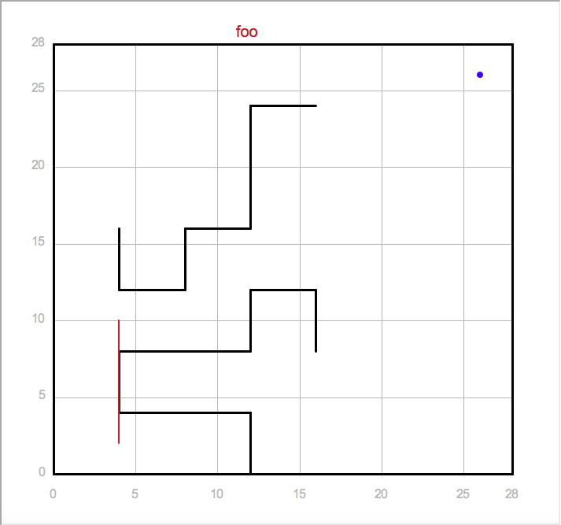

# Racetrack

This is a python script that uses tensorflow to train a neural network in order to figure out a (kind of optimal) way to get to the finish line. The racetrack is randomly generated each time in order to ensure that the grid is not mapped out and stored somewhere.

The program generates a racetrack like so:
                                    
